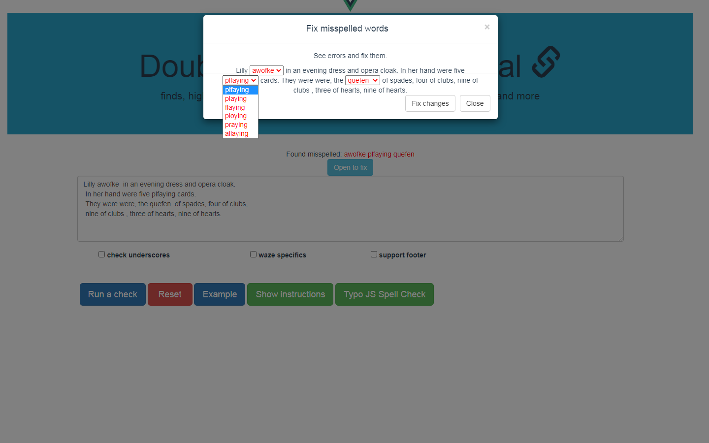

## Blankspace remover tool on Vue Framework.

> Text editing tool on Vue Framework. Additionally uses Typo-JS Library for spell check.

- <p> The application checks text for commom punctuantion errors; it performs a check, finds, highlights and fixes all double blankspaces, blankspace + comma, blankspace + full stop. </p>
- <p> Additionally, it fixes consecutive duplicates, double commas, double dots, cases when word is preceeded by comma without no space and more, see full list below.</p>
- <p> Spell check is also available on request (Typo-Js library)</p>
- <p> Ready build script can be found at /dist </p>

## Brief overview of the application


## On click the app corrects the text fixing found errors


## Detailed list of found errors


## Input check


## Checking for some specifics (if you tick the checkbox)


## Checking for misspelled words by Typo-JS Library




## Build Setup

``` bash
# install dependencies
npm install

# serve with hot reload at localhost:8080
npm run dev

# build for production with minification
npm run build

# build for production and view the bundle analyzer report
npm run build --report

# run unit tests
npm run unit

# run all tests
npm test
```

For a detailed explanation on how things work, check out the [guide](http://vuejs-templates.github.io/webpack/) and [docs for vue-loader](http://vuejs.github.io/vue-loader).
